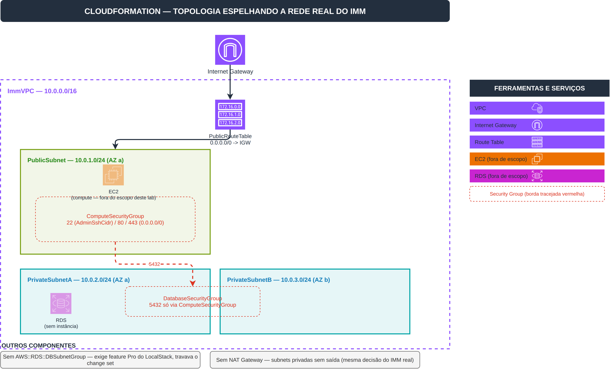

# Laboratório AWS CloudFormation — Infraestrutura Automatizada

Esta pasta é o entregável do desafio DIO "Implementando Infraestrutura Automatizada com AWS
CloudFormation". Diferente do primeiro desafio de CloudFormation deste repo (pasta
[`cloudformation/`](../cloudformation/), um stack único de S3+IAM+Lambda), este laboratório foca
no conceito de **automação de infraestrutura**: um template parametrizado, com Outputs exportados
para composição entre stacks, e um fluxo real de atualização via change set.

**Espelha a topologia real do IMM** ([imm-api](https://github.com/pedrolucazx/imm-api), um SaaS de
hábitos e diário — ver `docs/aws-modulo-4-redes.md` do repo `inside-my-mind`): 1 VPC com 1 subnet
pública (onde a EC2 real fica) e 2 subnets privadas em AZs diferentes (onde o RDS real fica —
subnet group de banco exige 2+ AZ), com Security Groups cruzados (compute libera SSH só do IP do
admin e HTTP/HTTPS públicos; banco libera Postgres só a partir do SG de compute, nunca direto da
internet). CloudFormation nunca foi usado pra provisionar o IMM real (a infra real foi via AWS CLI
puro; Terraform é o alvo real de IaC do projeto) — a conexão aqui é honesta: **se fôssemos
templatizar a rede real do IMM, seria assim**.

## O Que Foi Construído

17 recursos, 2 camadas de rede, com saída controlada pras subnets privadas via NAT Gateway:

| Recurso | Logical ID | Tipo | Propósito |
|---|---|---|---|
| VPC | `ImmVPC` | `AWS::EC2::VPC` | Rede isolada do laboratório |
| Subnet pública | `PublicSubnet` | `AWS::EC2::Subnet` | AZ `a`, onde compute (EC2) ficaria |
| Subnet privada A | `PrivateSubnetA` | `AWS::EC2::Subnet` | AZ `a`, onde banco ficaria |
| Subnet privada B | `PrivateSubnetB` | `AWS::EC2::Subnet` | AZ `b` — AZ diferente da A |
| Internet Gateway | `InternetGateway` | `AWS::EC2::InternetGateway` | Saída pra internet |
| Attachment do IGW | `VPCGatewayAttachment` | `AWS::EC2::VPCGatewayAttachment` | Liga o IGW à VPC |
| Route table pública | `PublicRouteTable` | `AWS::EC2::RouteTable` | Associada só à subnet pública |
| Rota pública | `PublicRoute` | `AWS::EC2::Route` | `0.0.0.0/0` → IGW |
| Associação de rota pública | `PublicSubnetRouteTableAssociation` | `AWS::EC2::SubnetRouteTableAssociation` | Liga a subnet pública à route table |
| EIP do NAT | `NatEip` | `AWS::EC2::EIP` | IP fixo pro NAT Gateway |
| NAT Gateway | `NatGateway` | `AWS::EC2::NatGateway` | Fica na subnet pública, dá saída pras privadas |
| Route table privada | `PrivateRouteTable` | `AWS::EC2::RouteTable` | Associada às 2 subnets privadas |
| Rota privada | `PrivateRoute` | `AWS::EC2::Route` | `0.0.0.0/0` → NAT Gateway |
| Associação de rota privada A | `PrivateSubnetARouteTableAssociation` | `AWS::EC2::SubnetRouteTableAssociation` | Liga a subnet privada A à route table privada |
| Associação de rota privada B | `PrivateSubnetBRouteTableAssociation` | `AWS::EC2::SubnetRouteTableAssociation` | Liga a subnet privada B à route table privada |
| SG de compute | `ComputeSecurityGroup` | `AWS::EC2::SecurityGroup` | 22 (admin), 80/443 (público) |
| SG de banco | `DatabaseSecurityGroup` | `AWS::EC2::SecurityGroup` | 5432 só via `ComputeSecurityGroup` |

**Diferente da decisão do IMM real, de propósito**: o IMM real nunca usou NAT Gateway (custa
~$33/mês só ligado, sem necessidade real — documentado em `docs/aws-modulo-4-redes.md`). Aqui, no
LocalStack, esse custo não existe, então faz sentido ter o NAT como exercício — a topologia fica
mais completa (saída controlada, não só isolamento). Verificado antes de implementar (leitura,
`describe-nat-gateways`, mais o serviço aparecendo documentado em
[docs.localstack.cloud/aws/services/](https://docs.localstack.cloud/aws/services/)) — sinal mais
forte do que o `DbSubnetGroup` teve.

5 Parameters (`VpcCidr`, `PublicSubnetCidr`, `PrivateSubnetACidr`, `PrivateSubnetBCidr`,
`AdminSshCidr` — todos com default, nenhum obrigatório) e 6 Outputs exportados, pra permitir que
outra stack referencie esses recursos via `Fn::ImportValue`.

**Fora de escopo, deliberadamente**: nenhuma instância EC2 nem RDS real é criada — o ponto do
laboratório é a topologia de rede (parametrização, camadas, Security Groups cruzados), não operar
uma aplicação de verdade. As 2 subnets privadas em AZs diferentes já provam o requisito real de
isolamento pra banco (RDS exige 2+ AZ pro subnet group) sem precisar do recurso RDS em si.

**Nota real de troubleshooting**: a primeira versão deste template incluía um
`AWS::RDS::DBSubnetGroup` declarando as 2 subnets privadas. Removido durante o desenvolvimento —
esse recurso específico exige o feature `rds:pro` do LocalStack, ausente na licença Hobby (grátis)
usada aqui, e travava `create-change-set` com timeout em vez de um erro claro. Achado direto no
log do container (`docker logs localstack-main`), não documentado nas páginas de preço/docs
públicas verificadas antes.

## Arquivos do Repositório

| Arquivo | Propósito |
|---|---|
| [`template.yaml`](./template.yaml) | Template CloudFormation da stack |
| [`runbook.md`](./runbook.md) | Comandos de mutação (deploy/change-set/teardown) — só o Pedro roda |
| [`images/architecture.drawio`](./images/architecture.drawio) | Diagrama de arquitetura editável |
| [`images/architecture.png`](./images/architecture.png) | Diagrama exportado para revisão |

## Design



O tráfego externo entra pelo Internet Gateway, roteado pela `PublicRouteTable` só até a
`PublicSubnet` (onde compute ficaria, protegido pelo `ComputeSecurityGroup`). As subnets privadas
não têm rota de saída — sem NAT Gateway, mesma decisão consciente já documentada na infra real do
IMM (custo de ~$33/mês só ligado, sem necessidade real). O `DatabaseSecurityGroup` só aceita
tráfego do `ComputeSecurityGroup` via `SourceSecurityGroupId` — nunca um CIDR direto, o banco
nunca fica exposto.

```text
Internet -> IGW -> PublicRouteTable -> PublicSubnet (ComputeSecurityGroup: 22/80/443)
                                            |
                                            v (5432, só via SG)
                            PrivateSubnetA / PrivateSubnetB (DatabaseSecurityGroup)
```

## Sobre rodar em LocalStack (escolha deliberada, não um downgrade)

Este laboratório roda contra o [LocalStack](https://www.localstack.cloud/) (tier Hobby, gratuito)
em vez da AWS real — mesma decisão consciente do outro laboratório novo deste repo
(`lambda-s3-object-lambda/`), trocado do [Floci](https://floci.io/) especificamente por causa das
necessidades do desafio Lambda+S3 (ver aquele README). CloudFormation em si funciona igualmente
bem nas duas ferramentas — confirmado via `validate-template` rodado direto contra ambas durante o
desenvolvimento. Nenhum comando de mutação (`create-stack`, `update-stack`, `delete-stack`,
`execute-change-set`) foi executado por um agente de IA em nenhum momento — todos estão
documentados em [`runbook.md`](./runbook.md) e foram rodados manualmente pelo autor, no próprio
terminal.

## Deploy

<!-- Preenchido de novo após o redeploy sem DbSubnetGroup (ver runbook.md "T011 (redesenho 2)") —
     o deploy anterior (12 recursos, incluía DbSubnetGroup) precisou ser refeito. -->

## Change Set

<!-- Preenchido após T011/T012 da v2: diff do change set (SecurityGroupEgress no ComputeSecurityGroup) -->

## Teardown

<!-- Preenchido após T014: data exata e confirmação de que o stack não existe mais -->
