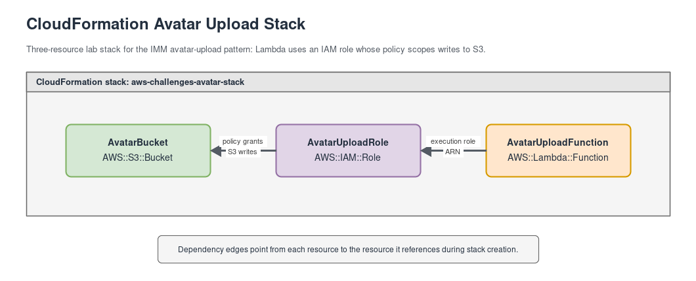
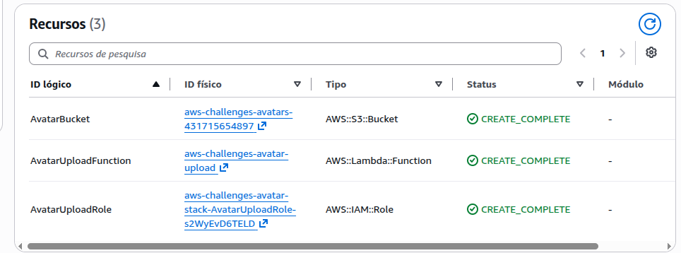

# Laboratório AWS CloudFormation — Upload de Avatar

Esta pasta é o entregável do desafio DIO "Implementando sua Primeira Stack com AWS
CloudFormation". Ela documenta uma stack pequena para provisionar o caminho de upload de avatar:
um bucket S3 privado, uma role IAM mínima e uma função Lambda que gera URL pré-assinada para
upload.

O padrão vem do [imm-api](https://github.com/pedrolucazx/imm-api), um SaaS de hábitos e diário. O
IMM torna o laboratório mais concreto: produtos reais precisam aceitar upload de imagens sem expor
credenciais AWS ao cliente. Este desafio reproduz só esse padrão de upload de avatar — não chama,
lê, faz deploy em, ou depende de nenhum bucket, Lambda, role IAM, usuário, avatar ou estado de
conta real do IMM.

## O Que Foi Construído

A stack do laboratório usa estes recursos isolados:

| Recurso | Nome no template | Propósito |
|---|---|---|
| Bucket S3 | `AvatarBucket` | Armazena os arquivos de avatar em um bucket privado e criptografado |
| Role IAM | `AvatarUploadRole` | Permite que a Lambda grave objetos no bucket e escreva logs no CloudWatch |
| Lambda | `AvatarUploadFunction` | Gera uma URL pré-assinada de `PutObject` para upload de avatar |

O bucket recebe o nome `aws-challenges-avatars-${AWS::AccountId}`. A função Lambda recebe o nome
`aws-challenges-avatar-upload`. A role IAM fica com nome físico gerado pelo CloudFormation, mantendo
o template simples e sem acoplamento a uma conta específica.

## Arquivos do Repositório

| Arquivo | Propósito |
|---|---|
| [`template.yaml`](./template.yaml) | Template CloudFormation da stack |
| [`images/architecture.drawio`](./images/architecture.drawio) | Diagrama de arquitetura editável |
| [`images/architecture.png`](./images/architecture.png) | Diagrama exportado para revisão |

## Design



O fluxo começa com um cliente pedindo uma URL de upload para a `AvatarUploadFunction`. A Lambda
valida a presença de `fileName`, monta um comando `PutObject` para o bucket definido em
`BUCKET_NAME` e devolve uma URL pré-assinada com expiração de 15 minutos.

O cliente usa essa URL para enviar o arquivo diretamente ao `AvatarBucket`. O bucket bloqueia
acesso público, criptografa objetos com SSE-S3 e não depende de nenhum recurso externo ao
laboratório.

A `AvatarUploadRole` limita a permissão de escrita ao bucket criado pela própria stack e libera
apenas as ações de log necessárias para a função. Isso mantém o exemplo próximo do padrão real do
IMM, mas isolado o suficiente para servir como base de estudo.

Fluxo principal:

```text
Cliente -> AvatarUploadFunction -> URL pré-assinada -> AvatarBucket
```

Este template também é uma semente candidata para uma migração futura para Terraform: os limites da
stack são pequenos, os logical IDs deixam os recursos explícitos e o design já separa armazenamento,
IAM e computação.

## Deploy

Stack `aws-challenges-avatar-stack` criada com sucesso (`CREATE_COMPLETE`, zero rollback).

| Output | Valor |
|---|---|
| `BucketName` | `aws-challenges-avatars-431715654897` |
| `FunctionArn` | `arn:aws:lambda:us-east-1:431715654897:function:aws-challenges-avatar-upload` |


