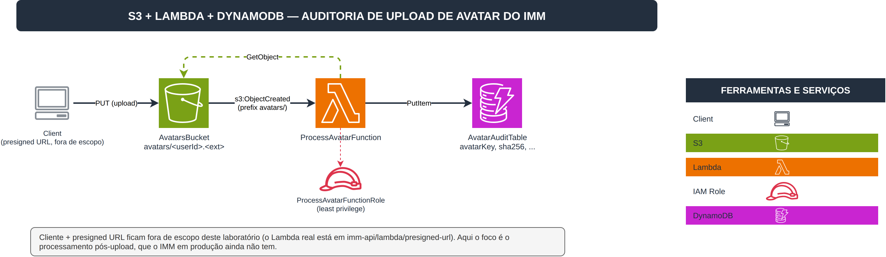

# Laboratório AWS Lambda + S3: Tarefas Automatizadas

Esta pasta é o entregável do desafio DIO "Executando Tarefas Automatizadas com Lambda Function e
S3". O padrão ensinado no curso é simples: upload num bucket S3 dispara uma Lambda, que processa o
arquivo e registra o resultado no DynamoDB.

**Espelha o fluxo real de upload de avatar do IMM** ([imm-api](https://github.com/pedrolucazx/imm-api),
ver `docs/aws-modulo-6-7-storage-lambda.md` do repo `inside-my-mind`):

- Em produção, o IMM já tem uma Lambda (`imm-api/lambda/presigned-url`) que gera uma URL assinada
  pra o cliente fazer upload direto no S3, na key `avatars/<userId>.<ext>` (jpg/png/webp, até 5MB)
- Esse laboratório assume esse mesmo upload como ponto de partida (cliente e presigned URL ficam
  fora de escopo aqui) e adiciona a etapa seguinte: uma Lambda que dispara quando o objeto chega no
  bucket, valida o content-type, calcula um hash SHA-256 do conteúdo, e grava um registro de
  auditoria no DynamoDB

Essa etapa de auditoria pós-upload não existe na produção real do IMM hoje. É uma extensão honesta
do pipeline existente, no espírito do que o desafio pede.

## O Que Foi Construído

5 recursos:

| Recurso | Logical ID | Tipo | Propósito |
|---|---|---|---|
| Bucket de avatares | `AvatarsBucket` | `AWS::S3::Bucket` | Recebe uploads em `avatars/<userId>.<ext>` |
| Tabela de auditoria | `AvatarAuditTable` | `AWS::DynamoDB::Table` | Um item por avatar processado |
| Role da função | `ProcessAvatarFunctionRole` | `AWS::IAM::Role` | Least privilege: `s3:GetObject` no prefixo, `dynamodb:PutItem` na tabela, logs |
| Função de processamento | `ProcessAvatarFunction` | `AWS::Lambda::Function` | Dispara em `s3:ObjectCreated`, valida, calcula hash, grava no DynamoDB |
| Permissão de invocação | `ProcessAvatarInvokePermission` | `AWS::Lambda::Permission` | Autoriza o S3 a invocar a função |

**Nota de design**: `AvatarsBucket` tem `BucketName` fixo (não gerado) e a `ProcessAvatarInvokePermission`
referencia esse nome via string, não via `!GetAtt AvatarsBucket`. Isso evita uma dependência
circular entre o bucket (que precisa da permissão pronta antes de aceitar a notification config) e
a permissão (que precisaria do bucket pronto para pegar o ARN) — a mesma classe de bug que travou
o `create-stack` no laboratório de CloudFormation (`cloudformation-infra-automatizada/`), corrigida
aqui de propósito antes de acontecer.

3 Outputs exportados (`AvatarsBucketName`, `ProcessAvatarFunctionArn`, `AvatarAuditTableName`).

**Nota real de troubleshooting**: a primeira versão deste desafio tentou implementar S3 Object
Lambda (transformação no `GetObject` via Object Lambda Access Point), seguindo um link de
documentação da AWS sugerido pelo próprio DIO. Um teste direto (`create-access-point`,
`create-access-point-for-object-lambda`) confirmou que o emulador local não suporta essas operações
de S3 Control. Pivotado para o padrão que as aulas realmente ensinam: evento S3 comum disparando
uma Lambda.

## Arquivos do Repositório

| Arquivo | Propósito |
|---|---|
| [`template.yaml`](./template.yaml) | Template CloudFormation da stack |
| [`lambdas/process-avatar/`](./lambdas/process-avatar/) | Handler testável (ESM) + teste |
| [`images/architecture.drawio`](./images/architecture.drawio) | Diagrama de arquitetura editável |
| [`images/architecture.png`](./images/architecture.png) | Diagrama exportado |

## Design



Um objeto chega em `avatars/<userId>.<ext>` no `AvatarsBucket`. O evento `s3:ObjectCreated`
(filtrado no prefixo `avatars/`) dispara `ProcessAvatarFunction`, que lê o objeto de volta
(`GetObject`), confere se o content-type é um dos aceitos (mesmos tipos do Lambda real de
presigned URL: jpeg, png, webp), calcula o SHA-256 do conteúdo, e grava um item no
`AvatarAuditTable` com key, usuário, content-type, tamanho, hash e timestamp.

## Sobre rodar em LocalStack

Este laboratório roda contra o [LocalStack](https://www.localstack.cloud/) (tier Hobby, gratuito)
em vez da AWS real, mesma decisão consciente do outro laboratório novo deste repo
(`cloudformation-infra-automatizada/`). A vantagem é clara: iteração rápida, sem custo e sem risco
de cobrança real da AWS.

## Como Rodar

```bash
cp .env.example .env   # preenche o LOCALSTACK_AUTH_TOKEN (raiz do repo, veja .env.example)

export AWS_ENDPOINT_URL=http://localhost:4566
export AWS_ACCESS_KEY_ID=test
export AWS_SECRET_ACCESS_KEY=test
export AWS_DEFAULT_REGION=us-east-1

docker compose up -d localstack   # sobe o LocalStack (docker-compose.yml na raiz do repo)

aws cloudformation create-stack \
  --stack-name aws-challenges-lambda-s3 \
  --template-body file://lambda-s3-object-lambda/template.yaml \
  --capabilities CAPABILITY_IAM

aws cloudformation wait stack-create-complete \
  --stack-name aws-challenges-lambda-s3
```

Teardown, quando quiser encerrar:

```bash
aws cloudformation delete-stack --stack-name aws-challenges-lambda-s3
aws cloudformation wait stack-delete-complete --stack-name aws-challenges-lambda-s3
```
