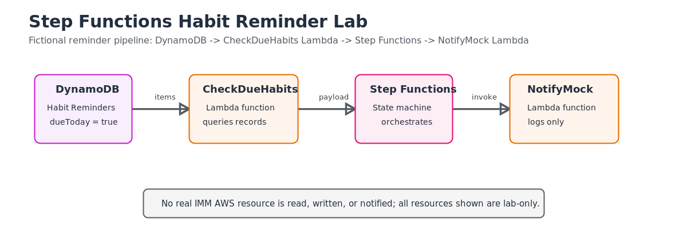

# AWS Step Functions Habit Reminder Lab

This folder is the deliverable for DIO's "Explorando Workflows Automatizados com AWS Step
Functions" challenge. It documents a small AWS Step Functions workflow that coordinates two Lambda
functions around one DynamoDB table, using a fictional habit reminder pipeline as the example.

The theme comes from [imm-api](https://github.com/pedrolucazx/imm-api), a habits and journal SaaS
project. IMM makes the lab more concrete: real products need background workflows that find due
habits or journal reminders and trigger notifications. This challenge copies only that concept. It
does not call, read, deploy into, or depend on any real IMM AWS resource.

## What Was Built

The lab workflow uses these isolated `aws-challenges-*` resources:

| Resource | Lab name | Purpose |
|---|---|---|
| DynamoDB table | `aws-challenges-habit-reminders` | Stores one fake due reminder item |
| Lambda | `aws-challenges-check-due-habits` | Queries reminders where `dueToday = true` |
| Lambda | `aws-challenges-notify-mock` | Logs the notification that would be sent |
| Step Functions state machine | `aws-challenges-habit-reminder` | Orchestrates the two Lambdas |

All sample data is fake, including `demo-reminder-1` and `demo-user-1`. No table, Lambda, IAM
role, SES identity, user, habit, journal entry, ARN, or account state from IMM is touched.

## Repository Files

| File | Purpose |
|---|---|
| [`state-machine.asl.json`](./state-machine.asl.json) | Amazon States Language definition |
| [`lambdas/check-due-habits/index.mjs`](./lambdas/check-due-habits/index.mjs) | First Lambda state |
| [`lambdas/notify-mock/index.mjs`](./lambdas/notify-mock/index.mjs) | Second Lambda state |
| [`images/architecture.drawio`](./images/architecture.drawio) | Editable architecture diagram |
| [`images/architecture.png`](./images/architecture.png) | Exported diagram for review |

## Design Walkthrough



The state machine starts with `CheckDueHabits`. That Lambda reads the lab-only DynamoDB table and
returns a `dueReminders` array containing reminders due today.

The workflow then passes that array to `NotifyMock`. This Lambda deliberately does not send email,
push notifications, or any real IMM notification. It logs messages such as "would notify
demo-user-1 about Drink water" and returns a count of mocked notifications.

If `CheckDueHabits` cannot query DynamoDB, it throws. The state machine catches that failure and
routes to `HandleFailure`, making the failure path visible in Step Functions instead of hiding the
problem inside a Lambda log.

Successful happy path:

```text
DynamoDB -> CheckDueHabits -> Step Functions -> NotifyMock -> Success
```

Failure path:

```text
CheckDueHabits -> HandleFailure
```

## Execution Evidence

The deployment and execution commands are documented in
[`../specs/001-step-functions-habit-lab/quickstart.md`](../specs/001-step-functions-habit-lab/quickstart.md).
Per this repository's constitution, every `aws` command is run manually by Pedro in his own
terminal, never by an AI agent.

After the real run is captured, this section should record:

| Field | Value |
|---|---|
| State machine ARN | Pending T014 |
| Execution ARN | Pending T014 |
| Execution date | Pending T014 |
| Screenshot | `images/execution-success.png` after T013 |
| Observed cost | Pending T014 |

## Teardown

Teardown is completed after the evidence screenshot is captured. The follow-up task records the
exact date, deleted resources, and verification result here.

| Field | Value |
|---|---|
| Teardown date | Pending T017 |
| Deleted resources | Pending T017 |
| Verification result | Pending T017 |

The required end state is zero remaining `aws-challenges-*` resources for this lab.
