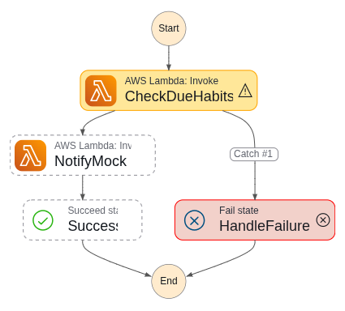

# Laboratório AWS Step Functions: Lembretes de Hábito

Esta pasta é o entregável do desafio DIO "Explorando Workflows Automatizados com AWS Step
Functions". Ela documenta um workflow real do Step Functions que orquestra duas funções Lambda em
torno de uma tabela DynamoDB, usando como exemplo um pipeline fictício de lembrete de hábitos.

O tema vem do [imm-api](https://github.com/pedrolucazx/imm-api), um SaaS de hábitos e diário. O
IMM torna o laboratório mais concreto: produtos reais precisam de workflows em segundo plano que
encontrem hábitos ou lembretes de diário pendentes e disparem notificações. Este desafio copia só
esse conceito. Não chama, lê, faz deploy em, ou depende de nenhum recurso AWS real do IMM.

## O Que Foi Construído

O workflow do laboratório usa estes recursos isolados, com prefixo `aws-challenges-*`:

| Recurso | Nome no laboratório | Propósito |
|---|---|---|
| Tabela DynamoDB | `aws-challenges-habit-reminders` | Guarda um item fake de lembrete pendente |
| Lambda | `aws-challenges-check-due-habits` | Busca lembretes onde `dueToday = true` |
| Lambda | `aws-challenges-notify-mock` | Loga a notificação que seria enviada |
| State machine (Step Functions) | `aws-challenges-habit-reminder` | Orquestra os dois Lambdas |

Todos os dados de exemplo são fictícios, incluindo `demo-reminder-1` e `demo-user-1`. Nenhuma
tabela, Lambda, role IAM, identidade SES, usuário, hábito, entrada de diário, ARN ou estado de
conta do IMM é tocado.

## Arquivos do Repositório

| Arquivo | Propósito |
|---|---|
| [`template.yaml`](./template.yaml) | Template CloudFormation da stack (tabela, roles, Lambdas, state machine) |
| [`state-machine.asl.json`](./state-machine.asl.json) | Definição em Amazon States Language (fonte da `DefinitionString` do template) |
| [`lambdas/check-due-habits/index.mjs`](./lambdas/check-due-habits/index.mjs) | Primeiro estado (Lambda) |
| [`lambdas/notify-mock/index.mjs`](./lambdas/notify-mock/index.mjs) | Segundo estado (Lambda) |
| [`images/architecture.drawio`](./images/architecture.drawio) | Diagrama de arquitetura editável |
| [`images/architecture.png`](./images/architecture.png) | Diagrama exportado para revisão |

## Design


A state machine começa em `CheckDueHabits`. Esse Lambda lê a tabela DynamoDB (isolada do
laboratório) e retorna um array `dueReminders` com os lembretes pendentes no dia.

O workflow então passa esse array para `NotifyMock`. Esse Lambda deliberadamente não envia
e-mail, push, nem qualquer notificação real do IMM. Ele loga mensagens como "would notify
demo-user-1 about Drink water" e retorna a contagem de notificações simuladas.

Se `CheckDueHabits` não conseguir consultar o DynamoDB, ele lança uma exceção. A state machine
captura essa falha e roteia para `HandleFailure`, deixando o caminho de falha visível no Step
Functions em vez de escondido num log de Lambda.

Caminho de sucesso:

```text
DynamoDB -> CheckDueHabits -> Step Functions -> NotifyMock -> Success
```

Caminho de falha:

```text
CheckDueHabits -> HandleFailure
```

## Deploy na AWS real

Workflow criado e executado com sucesso na conta AWS real, os dois caminhos testados (sucesso e
falha).




**Teardown ainda pendente** nessa conta. Comandos preparados abaixo, rodados manualmente por Pedro
quando for encerrar (nenhum agente de IA roda `aws` contra a conta real):

```bash
aws stepfunctions delete-state-machine --state-machine-arn <arn-da-state-machine>
aws lambda delete-function --function-name aws-challenges-check-due-habits
aws lambda delete-function --function-name aws-challenges-notify-mock
aws dynamodb delete-table --table-name aws-challenges-habit-reminders
```

## Rodando também no LocalStack

Depois do deploy real, esse desafio passou a rodar também no [LocalStack](https://www.localstack.cloud/)
(plano Student), mesma motivação dos outros laboratórios deste repo: iteração rápida, sem custo,
sem risco de cobrança real da AWS. O `template.yaml` reproduz os mesmos 4 recursos via
CloudFormation.

```bash
cp .env.example .env   # preenche o LOCALSTACK_AUTH_TOKEN (raiz do repo, veja .env.example)

export AWS_ENDPOINT_URL=http://localhost:4566
export AWS_ACCESS_KEY_ID=test
export AWS_SECRET_ACCESS_KEY=test
export AWS_DEFAULT_REGION=us-east-1

docker compose up -d localstack   # sobe o LocalStack (docker-compose.yml na raiz do repo)

aws cloudformation create-stack \
  --stack-name aws-challenges-habit-reminders \
  --template-body file://step-functions/template.yaml \
  --capabilities CAPABILITY_IAM

aws cloudformation wait stack-create-complete \
  --stack-name aws-challenges-habit-reminders
```

CloudFormation não tem um jeito nativo de inserir itens numa tabela DynamoDB, então o item fake de
teste precisa de um passo manual à parte:

```bash
aws dynamodb put-item \
  --table-name aws-challenges-habit-reminders \
  --item '{"reminderId": {"S": "demo-reminder-1"}, "habitName": {"S": "Drink water"}, "fakeUserId": {"S": "demo-user-1"}, "dueToday": {"BOOL": true}}'

aws stepfunctions start-execution \
  --state-machine-arn "arn:aws:states:us-east-1:000000000000:stateMachine:aws-challenges-habit-reminder" \
  --input '{}'
```

Teardown, quando quiser encerrar:

```bash
aws cloudformation delete-stack --stack-name aws-challenges-habit-reminders
aws cloudformation wait stack-delete-complete --stack-name aws-challenges-habit-reminders
```
